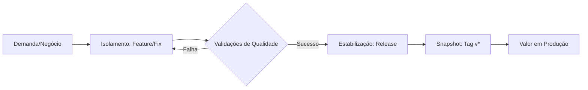

# Roteiro de Apresentação: Evolução da Resiliência Operacional com Git

**Público-alvo:** Desenvolvedores Sêniores e Arquitetos.
**Duração:** 30 Minutos.
**Objetivo:** Demonstrar como a rastreabilidade e a precisão técnica preservam o valor das entregas durante ajustes em ambiente produtivo.

---

## 1. O Desafio da Continuidade: Refinando nossa Resposta a Instabilidades (5 min)

**Narrativa de Abertura:**
*   Reconhecer a complexidade de operar em ambientes de alta criticidade e a pressão natural que o time enfrenta em momentos de instabilidade.
*   **O Cenário de Contingência:** Validar as decisões de restauração para garantir a disponibilidade do serviço como uma prioridade absoluta da equipe.
*   **Oportunidade de Evolução:** Discutir como aprimorar nossas ferramentas para isolar pontos de instabilidade de forma cirúrgica, preservando as funcionalidades saudáveis entregues no mesmo ciclo.

---

## 2. Fluxo de Negócio: O Valor do Ciclo de Vida (5 min)

**A tese:** O alinhamento ao ciclo de vida transforma imprevistos em métricas gerenciáveis, garantindo a previsibilidade e a confiança nas entregas.



**Pilar para o Time:** Se o commit é atômico e semântico, o tempo médio de recuperação (MTTR) cai drasticamente.

---

## 3. Estudo de Caso: A Saga do PetShop (15 min)

**Estudo de Caso 1: Gestão de Instabilidade Seletiva (Revert)**
Identificamos uma instabilidade de consumo de memória na versão `v0.1.1`, que foi integrada juntamente com a funcionalidade de Carrinho.

### Evolução do Histórico (Cenário 1)

```mermaid
gitGraph
    commit id: "Base Estável" tag: "v0.1.0"
    branch develop
    checkout develop
    commit id: "feat: Carrinho (Ativo)"
    commit id: "chore: Jacoco (Instabilidade)"
    checkout master
    branch release-0.1.1
    checkout release-0.1.1
    commit id: "fix: Ajuste Final"
    checkout master
    merge release-0.1.1 id: "v0.1.1 (Ajuste Necessário)" tag: "v0.1.1"
    checkout master
    branch hotfix/revert-seletivo
    commit id: "Ajuste Seletivo (Jacoco)"
    checkout master
    merge hotfix/revert-seletivo id: "v0.1.2 (Estabilizado)" tag: "v0.1.2"
    checkout develop
    merge master id: "back-merge-sync"
```

**Justificativa Técnica:**
*   **Não usamos Reset:** Se usássemos reset para a `v0.1.0`, o "Carrinho" morreria em produção.
*   **Usamos Revert:** O Carrinho continua ativo. O Jacoco foi removido cirurgicamente.
*   **Back-merge:** Essencial para que a `develop` saiba que o Jacoco deve ser corrigido antes da próxima tentativa.

---

**Estudo de Caso 2: Transplante de Funcionalidade (Cherry-pick)**
Identificamos a necessidade urgente de incluir a funcionalidade de "Cupom" em uma versão que já está em homologação, enquanto a `develop` contém manutenções que não devem subir no momento.

### Evolução do Histórico (Cenário 2)

```mermaid
gitGraph
    commit id: "v0.1.2" tag: "v0.1.2"
    branch develop
    checkout develop
    commit id: "Manutenção: DB (Em Teste)"
    branch feat/cupom-urgente
    checkout feat/cupom-urgente
    commit id: "feat: Lógica do Cupom"
    commit id: "feat: UI do Cupom"
    checkout develop
    commit id: "Manutenção: API (Em Teste)"
    branch release-0.2.0
    checkout release-0.2.0
    cherry-pick id: "feat: Lógica do Cupom"
    cherry-pick id: "feat: UI do Cupom"
    commit id: "Ajuste de Release"
    checkout master
    merge release-0.2.0 id: "v0.2.0" tag: "v0.2.0"
    checkout develop
    merge release-0.2.0 id: "back-merge-v0.2.0"
```

**Justificativa Técnica (Cenário 2):**
*   **Integração Cirúrgica:** O `cherry-pick` permitiu capturar apenas os commits de valor sem herdar as manutenções instáveis da develop.
*   **Independência de Fluxos:** O desenvolvimento de infraestrutura pôde continuar seu ciclo normal de testes sem bloquear a entrega de negócio urgente.
*   **Segurança Operacional:** Evitamos a "poluição" da branch de release com códigos não homologados, garantindo que o impacto no QA seja restrito à nova feature.

---

## 4. Hands-on: Onde a Mágica Acontece (GitHub + VS Code)

### No VS Code (Simulando a Cirurgia e o Transplante)
1.  Mostrar o `git log --graph --oneline`. O grafo deve ser legível.
2.  **Simular o Revert:** Identificar o ponto de instabilidade e executar `git revert -m 1 <hash>`.
3.  **Simular o Cherry-pick:** Localizar os commits específicos da feature urgente e "transplantá-los" para a branch de release.
4.  **Destaque:** Evidenciar que em ambos os casos a estrutura saudável do código permanece intacta, ajustando ou transportando apenas o componente necessário.

## 5. Conclusão: O Ganho Real (5 min)

*   **Para a Empresa:** Menos tempo de site fora do ar (Downtime).
*   **Para o Time:** Fim do "sábado de rollback total". Respeitar o ecossistema Git permite que você desfaça apenas o erro, não o progresso.
*   **A Promessa:** "Nós não apagamos o passado com Reset, nós evoluímos o histórico com Revert."

---

### Resumo de Comandos para o Live Demo:
```bash
# Visualizar a evolução do histórico
git log --oneline --graph --all

# Ajuste cirúrgico: Reverter apenas o ponto de instabilidade
git revert -m 1 <hash>

# Transplante: Aplicar commit específico em outra linhagem
git cherry-pick <hash>

# Auditoria: Ver quem criou a tag e por que
git show v0.1.1
```
