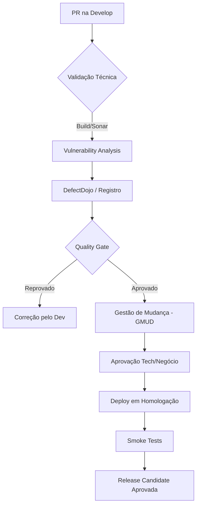
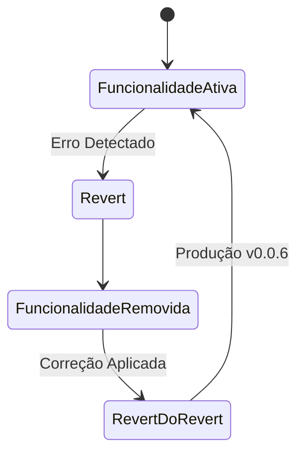
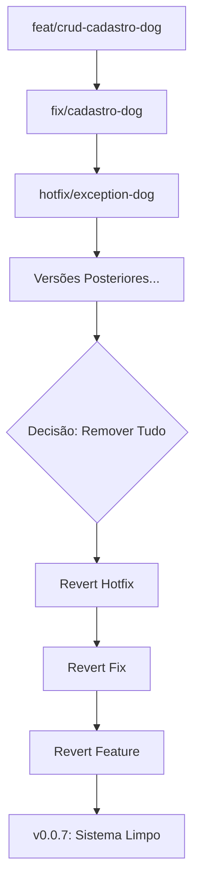

# Workshop: Resiliência no Ecossistema GitHub Enterprise

## 1. Introdução e Objetivos Éticos
Este guia foi desenhado para arquitetos e desenvolvedores que operam em ambientes de alta criticidade. O foco não é apenas o "caminho feliz", mas como o Git nos salva em situações de estresse sob pressão de entrega.

**Objetivos de Aprendizado:**
*   Domínio do ciclo de vida de uma demanda (Clone to Prod).
*   Gestão de conflitos e rollback seletivo (reverter um erro sem perder outras entregas).
*   Rastreabilidade total e governança em ambientes regulados.
*   Padronização de comunicação via Commits e Tags.


## 2. Visão Macro: A Esteira de Validação (O "Check-point")

Antes de aprofundarmos no Git, precisamos entender os portões de qualidade que protegem a `master`. A esteira não é um obstáculo, mas uma rede de segurança.

### Fluxograma de Governança



**Pontos Críticos de Validação:**
1.  **Static Analysis (Sonar):** Cobertura > 80%, 0 Bugs Críticos.
2.  **SCA/SAST (Snyk/Checkmarx):** Bloqueio de vulnerabilidades conhecidas.
3.  **GMUD (ServiceNow/Jira):** Registro formal para auditoria e conformidade.
4.  **DSV Rotate Pass:** Validação de segredos e rotação de credenciais antes do deploy.

---

## 3. Arquitetura de Branching

Adotamos um modelo híbrido para garantir agilidade e estabilidade.

| Tipo de Branch | Prefixo | Origem | Destino de Merge | Finalidade Detalhada (Explicação Didática) |
| :--- | :--- | :--- | :--- | :--- |
| **Feature** | `feat/` | `develop` | `develop` | **Criação de Funcionalidades:** É a branch onde o trabalho do dia a dia acontece. Sempre nasce da `develop` e retorna para ela. Garante que novas funcionalidades fiquem isoladas e não "quebrem" o código principal até estarem prontas. |
| **Fix** | `fix/` | `develop` | `develop` | **Correção de Desenvolvimento:** Destinada a resolver bugs detectados durante a fase de construção ou em ambiente de teste de desenvolvimento. Serve para manter a branch `develop` estável para o restante da equipe. |
| **Release** | `release-X.Y.Z` | `develop` | `master` & `develop` | **Homologação e Preparação:** Atua como um "estágio" antes da produção. Permite correções de última hora (bugfixes de QA) e testes de aceitação sem bloquear o desenvolvimento de novas features na `develop`. No final, consolida a versão na `master` e sincroniza as correções de volta para a `develop`. |
| **Hotfix** | `hotfix/` | `master` | `master` & `develop` | **Emergência em Produção:** A única branch que nasce da `master`. Serve para apagar "incêndios" (bugs críticos) em produção. Deve ser mergeada na `master` para aplicar a correção imediata e na `develop` para garantir que o bug não volte na próxima release. |
| **Tag** | `v*` | `master` | - | **Snapshot Imutável:** Representa um ponto fixo no tempo (uma versão específica). É o "carimbo" final que diz exatamente o que foi implantado. Essencial para auditoria, rastreabilidade e processos de rollback rápidos. |
---

## 4. Padronização e Semântica (Conventional Commits)

Para que a rastreabilidade seja eficaz, utilizamos o padrão de **Conventional Commits**. Isso permite que qualquer pessoa (ou máquina) entenda o histórico do projeto sem abrir o código.

### Estrutura do Commit
A mensagem deve seguir a estrutura técnica: `<tipo>(<escopo>): <descrição>`

### Tipos de Entrega
*   **feat:** Uma nova funcionalidade. (Gera um **MINOR** no SemVer).
*   **fix:** Correção de um erro técnico. (Gera um **PATCH** no SemVer).
*   **chore:** Manutenção de bibliotecas, arquivos de configuração ou ferramentas.
*   **docs:** Alterações exclusivas em documentação (README, Swagger e Wiki).
*   **refactor:** Mudança no código que não altera comportamento nem corrige erro.
*   **perf:** Alterações focadas estritamente em ganho de performance.
*   **test:** Adição, correção ou refatoração de testes.
*   **build:** Mudanças que afetam o sistema de build ou dependências externas.
*   **ci:** Mudanças em scripts e configurações de CI/CD (GitHub Actions, etc).
*   **hotfix:** Correção crítica urgente aplicada diretamente em produção.

### Mudanças Quebrantes (Breaking Changes)
Indicadas com um `!` após o tipo/escopo. Sinaliza que a mudança quebra a compatibilidade com versões anteriores.
*   **Exemplo:** `feat(api)!: altera contrato de resposta do login` (Gera um **MAJOR** no SemVer (Versionamento)).

**Dica de Ouro:** Além do `!`, é recomendado usar o rodapé da mensagem para detalhar a mudança:
```bash
git commit -m "feat(api)!: altera contrato de resposta do login

O campo 'token' foi renomeado para 'accessToken' para seguir o padrão OAuth2.

BREAKING CHANGE: Clientes que utilizam o campo 'token' na resposta do login
precisaram atualizar para 'accessToken'."
```

### O Escopo (Scope)
Indica o módulo ou contexto afetado (ex: `auth`, `ui`, `billing`). Ajuda a filtrar logs e entender rapidamente o raio de impacto da mudança.

### A Importância do Comentário Estruturado
Um commit bem escrito resolve 50% de um incidente. Ele deve responder: **O que foi feito e por que foi feito?**

**Corpo e Rodapé (Body & Footer):** Use o corpo da mensagem para explicar o "porquê" técnico e o rodapé para referenciar IDs de tarefas ou fechar Issues automaticamente.

**Exemplo Ruim:** `git commit -m "ajuste bug"` (Onde? Por quê?)
**Exemplo Profissional:**
```bash
git commit -m "fix(pagamento): corrige arredondamento de centavos no checkout

O arredondamento estava causando divergência de 1 centavo em pagamentos com cartão de crédito.
A lógica foi ajustada para utilizar BigDecimal com ROUND_HALF_UP.

Ref: Card #442"
```

---

## 5. O Ciclo de Release (Homologação)

A branch de `release` funciona como a nossa "sala de espera" para a produção. É o ponto de congelamento (**Code Freeze**) onde o código sai do fluxo contínuo de desenvolvimento e entra em um estado de refinamento e validação final.

**No que a Release ajuda?**
*   **Isolamento de Versão:** Garante que o QA teste uma versão estática. Novas funcionalidades que entrarem na `develop` após o corte da release não "contaminam" a entrega atual.
*   **Segurança para o Desenvolvedor:** O time pode continuar trabalhando na próxima Sprint na `develop` sem medo de quebrar o que está sendo homologado.
*   **Ambiente de Homologação:** A branch de release é o espelho fiel do ambiente de UAT/QA.
*   **Estabilização Técnica:** Permite focar exclusivamente em correções de bugs de última hora e ajustes finos de configuração sem interferência de novas funcionalidades.

**Ciclo de Vida da Release:**
1.  **Corte (Branching):** Criada exclusivamente a partir da `develop` quando o escopo da versão está pronto (`git checkout -b release-1.2.0 develop`).
2.  **Habilitação de Testes:** O pipeline de CI/CD detecta a branch e faz o deploy automático no ambiente de Homologação (STG/UAT).
3.  **Correções em Release (Bugfixes):** Se o QA encontrar erros, os ajustes são feitos **diretamente na branch de release**.
4.  **Fechamento:** Após aprovação do UAT, a branch é mergeada na `master` para deploy e na `develop` para sincronização.

**Regras e Versionamento:**
*   **Sem Novos Merges (Regra Geral):** Em fluxo normal, não se adiciona features em release. Se o negócio exigir (Exceção), mergeamos a **feature branch** na release, nunca a `develop`.
*   **Padrão de Nome:** Segue o versionamento semântico (Major.Minor.Patch), ex: `release-1.2.0`.
*   **Portão de QA:** Ela é a validação final. A aprovação do QA nesta branch é o gatilho mandatório para o merge na `master`.
*   **Back-merge Obrigatório:** Toda correção (bugfix) realizada na release **DEVE** ser mergeada de volta para a `develop` após o deploy em produção, evitando que o bug "ressuscite" na próxima versão.

> **Glossário de Homologação:**
> *   **QA (Quality Assurance):** Validação técnica e funcional realizada por especialistas para garantir que o código não possui bugs e atende aos requisitos.
> *   **UAT (User Acceptance Testing):** Validação de negócio realizada pelo usuário final ou PO para garantir que a solução atende às necessidades reais de uso.

> **Observação Importante:** Desenvolvedor **NÃO** é tester, nem QA, nem UAT. Por questões de governança e segregação de funções, nesta etapa de release o desenvolvedor não deve ter acesso ao processo de teste ou à homologação das suas próprias entregas.

---

## 6. O Poder das Tags (Snapshot de Produção)

A branch `master` contém o histórico, mas a **Tag** é o ponto de verdade absoluta.

> **Regra de Ouro:** A tag só é criada quando uma nova versão será gerada ou a cada atualização/merge da branch de release na branch `master`. **Tags são imutáveis; se a tag v1.0.0 foi gerada com erro, corrige-se e gera-se a v1.0.1.**

### Tipos de Tags no Git
1.  **Lightweight (Leve):** Apenas um ponteiro para um commit. Não armazena dados extras.
2.  **Annotated (Anotada):** Armazena metadados (autor, e-mail, data, mensagem) como um objeto completo no banco de dados do Git. **Sempre utilize Tags Anotadas para produção e auditoria.**

### Guia de Comandos: Criando e Subindo uma Tag

Para que o Arquiteto DevOps tenha rastreabilidade total, siga estes passos na branch `master`:

```bash
# 1. Certifique-se de estar na master e sincronizado com o servidor
git checkout master
git pull origin master

# 2. Criar a Tag Anotada
# -a: Nome da tag (ex: v1.0.0)
# -m: Mensagem explicativa (Fundamental para auditoria e geração de CHANGELOGs)
git tag -a v1.0.0 -m "Release 1.0.0: Implementação do checkout e correção crítica no login"

# 3. Verificar se a tag foi criada localmente com os metadados
git tag -n

# 4. Subir a tag para o servidor (O push comum de branch não envia tags por padrão)
# Este comando geralmente aciona gatilhos (triggers) da esteira de Deploy (CD).
git push origin v1.0.0
```

**Por que usar Tags?**
1.  **Imutabilidade:** Uma Tag aponta para um commit específico e nunca deve ser alterada.
2.  **Rollback Ágil:** Se a versão atual quebrar, o DevOps sabe exatamente qual tag anterior estava estável para fazer o deploy imediato.
3.  **Auditoria:** Facilita identificar exatamente o que foi para produção na data X.
4.  **Versionamento Semântico (SemVer):** Permite o controle de versões (Major.Minor.Patch).
    *   **MAJOR (X.0.0):** Quebra de compatibilidade. Ex: Alteração de contrato de API, troca de banco de dados ou remoção de funções.
    *   **MINOR (1.X.0):** Novas funcionalidades compatíveis. Ex: Novos endpoints, novas telas ou melhorias de performance (Refact) sem mudar a interface.
    *   **PATCH (1.0.X):** Correções de bugs e segurança. Ex: Ajuste de NullPointer, correção de CSS ou atualização de bibliotecas vulneráveis (Chore).

> **Nota para Arquitetos:** Durante o desenvolvimento inicial (versões 0.x.x), o SemVer é mais flexível, mas a partir da `v1.0.0`, a compatibilidade deve ser tratada como lei.

### Como Auditar uma Tag
Use o comando `git show v1.0.0` para ver os detalhes de quem criou, quando foi criada e o conteúdo exato do commit tagueado.

---

## 7. Cenários Realistas e Gestão de Crise

### Cenário A: O Fluxo Padrão (Sucesso)

**Cenário:** O desenvolvedor precisa corrigir um erro no login.

```bash
# Criando a branch de trabalho
git switch develop
git switch -c fix/01-login

# Commits com padrão Conventional Commits
git commit -m "fix(auth): corrige expiração do token JWT no login"
git push origin fix/01-login
```

Após aprovação do PR, a `develop` consolida as entregas. Para subir, criamos a `release-0.0.1`.

---

### Cenário B: O Incidente Crítico (Stress de Produção)

**Contexto:** Subimos a versão `v0.0.2` contendo:
1. PR104: `fix/03-pagamento`
2. PR105: `docs/01-api-pagamento`
3. PR106: `chore/01-jacoco-lib` (O Vilão)

**O Problema:** O `chore/01-jacoco-lib` causou um estouro de memória no pod em produção. O pipeline de monitoramento (New Relic/Dynatrace) está em alerta vermelho.

**A Decisão do Arquiteto:** Não podemos fazer um "Rollback de Ambiente" (voltar o backup) porque perderíamos a correção crítica de pagamentos (PR104). Precisamos de um **Revert Seletivo**.

#### Passo 1: Identificar o culpado na linha do tempo
```bash
git log --merges --oneline
# Saída:
# a1b2c3d Merge pull request #106 from chore/01-jacoco-lib
# e5f6g7h Merge pull request #104 from fix/03-pagamento
```

#### Passo 2: Executar o Hotfix de Reversão
```bash
git switch master
git switch -c hotfix/01-remover-jacoco

# Revertendo o merge específico do PR106
git revert -m 1 a1b2c3d

# Gerando a tag emergencial v0.0.3
git tag -a v0.0.3 -m "Fix: Estabilização do ambiente - Removendo Jacoco"
git push origin master --tags
```

**Resultado:** A funcionalidade de pagamentos continua ativa, mas o código problemático do Jacoco foi removido cirurgicamente.

---

### Cenário C: Descoberta Tardia e Impacto Financeiro

**Situação:** Semanas após o deploy da `v0.0.1`, o setor financeiro detecta erro de arredondamento no `feat/01-carrinho`.

**Desafio:** Há dezenas de merges após esse commit. Um `reset` é impossível.

**Solução Técnica:**
```bash
git switch master
git switch -c hotfix/02-remover-carrinho

# Localizar o merge antigo (PR103)
git log --merges --grep="feat/01-carrinho"

# Reverter mantendo a integridade da árvore
git revert -m 1 <HASH_DO_PR103>

git tag -a v0.0.5 -m "Hotfix: Desativação temporária do carrinho por erro financeiro"
git push origin master --tags
```

---

### Cenário D: Mudança de Escopo (Inclusão Urgente na Release)

**Situação:** A `release-0.0.1` está em teste (QA) há 3 dias. Surge uma necessidade de negócio para incluir a `feat/cupom-urgente`, mas a `develop` já tem outras 5 tarefas que não podem subir.

**Ação:** Jamais mergeie a `develop` na `release`. Faça o merge seletivo da branch de feature.
**O Desafio Técnico:** Como a `feat/cupom-urgente` nasceu da `develop`, se usarmos o `merge` convencional, o Git trará todos os commits ancestrais (incluindo as outras 5 tarefas indesejadas).

**Ação:** Para uma inclusão cirúrgica, utilizamos o `git cherry-pick`.

```bash
git switch release-0.0.1
# Identificar os hashes dos commits da sua feature
git log feat/cupom-urgente --oneline

# Exemplo de saída:
# a1b2c3d feat(cupom): lógica de desconto
# e5f6g7h feat(cupom): integração com checkout

# Aplicar apenas estes commits na release (do mais antigo para o mais novo)
git cherry-pick e5f6g7h
git cherry-pick a1b2c3d

# Resolver conflitos (se houver) e subir
git push origin release-0.0.1
```

**Impacto:** O ciclo de QA/UAT deve ser reiniciado para garantir que a nova feature não quebrou as correções que já haviam sido validadas.

---

### Cenário E: Reintroduzindo uma Feature Corrigida (Revert do Revert)

**Introdução:** O pânico do Cenário C passou, e o time teve tempo de consertar o erro. Agora precisamos "desfazer o desfazer". No Git, um revert é um commit. Reverter o revert é a forma mais limpa de restaurar a funcionalidade sem causar conflitos de "código já existente".



**O Desafio Técnico:** O Git "lembra" que você rejeitou aquelas linhas. Mergear a branch antiga novamente resultará em um merge vazio ou conflitos bizarros.

**Ação:** A melhor prática para reintroduzir o código preservando a integridade do histórico é reverter o próprio commit de reversão.

```bash
git switch master
git switch -c hotfix/03-reativar-carrinho

# 1. Localizar o commit de REVERT feito no Cenário C
git log --oneline --grep="remover-carrinho"

# 2. Reverter a reversão (isso traz o código original de volta)
git revert <HASH_DO_REVERT_ANTERIOR>

git tag -a v0.0.6 -m "Feature: Reativando carrinho com correções financeiras"
git push origin master --tags
```

---

### Cenário F: Remoção Total de Feature com Dependências (Revert em Cascata)

**Introdução:** Este é o cenário de "limpeza profunda". A feature `feat/crud-cadastro-dog` subiu, quebrou, foi corrigida por um `fix` na release e depois por um `hotfix` na master. Várias versões depois, o PO decide que a feature deve ser removida para ser reimplementada do zero. A calma aqui é vital: se você reverter apenas o commit inicial da feature, os commits do `fix` e do `hotfix` podem causar erros de compilação ou comportamentos bizarros.



**Ação:** Identificar toda a árvore de dependência da feature e reverter em ordem reversa (LIFO - Last In, First Out).

```bash
git switch master
git switch -c hotfix/remover-total-cadastro-dog

# 1. Identificar todos os merges relacionados (Feature, Fix, Hotfix)
git log --merges --oneline --grep="cadastro-dog"

# 2. Reverter na ordem INVERSA (do mais recente para o mais antigo)
git revert -m 1 <HASH_HOTFIX_EXCEPTION>
git revert -m 1 <HASH_FIX_RELEASE>
git revert -m 1 <HASH_FEATURE_ORIGINAL>

git tag -a v0.0.7 -m "hotfix: Remoção completa da feature Cadastro Dog e dependências"
git push origin master --tags
```

---

## 8. Linha do Tempo Comparativa (Visual)

Abaixo, o organograma do que ocorreu no repositório após todos os incidentes. Note a importância estratégica do **Back-merge** para evitar a regressão de bugs:

```mermaid
gitGraph
    commit id: "v0.0.1 (Base)"
    branch develop
    checkout develop
    commit id: "fix/03-pagamento"
    commit id: "chore/01-jacoco"

    branch release-0.0.2
    checkout release-0.0.2
    commit id: "fix: QA feedback"
    checkout master
    merge release-0.0.2 id: "v0.0.2" tag: "v0.0.2"
    checkout develop
    merge release-0.0.2 id: "back-merge-v0.0.2"

    checkout master
    branch hotfix-revert-jacoco
    checkout hotfix-revert-jacoco
    commit id: "REVERT PR106"
    checkout master
    merge hotfix-revert-jacoco id: "v0.0.3" tag: "v0.0.3"
    checkout develop
    merge master id: "sync-hotfix-v0.0.3"

    checkout develop
    commit id: "fix/04-jacoco-final"
    checkout master
    merge develop id: "v0.0.4" tag: "v0.0.4"

    checkout master
    branch hotfix-revert-carrinho
    checkout hotfix-revert-carrinho
    commit id: "REVERT PR103 (Antigo)"
    checkout master
    merge hotfix-revert-carrinho id: "v0.0.5" tag: "v0.0.5"
    checkout develop
    merge master id: "sync-hotfix-v0.0.5"

    checkout master
    branch hotfix-reativar-carrinho
    checkout hotfix-reativar-carrinho
    commit id: "REVERT DO REVERT (Carrinho)"
    checkout master
    merge hotfix-reativar-carrinho id: "v0.0.6" tag: "v0.0.6"
    checkout develop
    merge master id: "sync-hotfix-v0.0.6"

    checkout master
    branch hotfix-remover-dog
    checkout hotfix-remover-dog
    commit id: "REVERT CASCATA (DOG)"
    checkout master
    merge hotfix-remover-dog id: "v0.0.7" tag: "v0.0.7"
    checkout develop
    merge master id: "sync-hotfix-v0.0.7"
```

---

## 9. Checklist para o Tech Lead / Arquiteto

1.  **Nunca use `git push --force` na master:** Utilize `git revert` para manter o histórico e a rastreabilidade de quem aprovou o quê.
2.  **Pull Requests Atômicos:** PRs pequenos facilitam o rollback seletivo. PRs gigantes tornam o `revert` um pesadelo de conflitos.
3.  **Tags são Imutáveis:** Uma vez criada a tag `v0.0.1`, ela nunca deve ser movida. Errou? Crie a `v0.0.2`.
4.  **Rastreabilidade:** Todo commit de revert deve mencionar o ID do incidente ou o número do PR original.
5.  **Sincronização de Hotfixes (Back-merge):** Sempre que um `hotfix` for mergeado na `master`, ele deve ser mergeado de volta na `develop` imediatamente. Se não fizer isso, o erro corrigido voltará na próxima release (regressão de bug).
6.  **Proteção de Branches:** Utilize as *Branch Protection Rules* do GitHub. Force a exigência de revisores (Code Review) e bloqueie merges se o pipeline de CI estiver falhando.
7.  **Segurança e Segredos:** Ative o *Secret Scanning*. Jamais permita que chaves de API, senhas ou tokens sejam commitados, mesmo em ambientes de desenvolvimento.
8.  **Resolução de Conflitos:** A responsabilidade de resolver conflitos e garantir que o merge não quebrou nada é do **autor do Pull Request**, não do revisor ou do Tech Lead.
9.  **Pipeline é Lei:** Nunca ignore um sinal vermelho no Sonar ou falha em testes unitários. O bypass da esteira é um risco técnico que deve ser evitado ao máximo e documentado quando inevitável.

---

## 10. Mergulhando em Segurança e Governança

### 10.1 Branch Protection Rules (As Grades de Proteção)
Não confiamos apenas na boa vontade; configuramos travas técnicas. No GitHub Enterprise, as seguintes regras são mandatórias para `master` e `develop`:

*   **Require a pull request before merging:** Ninguém sobe código direto. O código deve passar por um PR.
    *   *Dica de Ouro:* Ative "Require approvals" (mínimo de 1 ou 2 revisores).
*   **Require status checks to pass:** O botão de Merge só fica verde se o pipeline de CI (Build + Testes + Sonar) retornar sucesso. Se a esteira quebrou, o código não entra.
*   **Restrict force pushes:** Impede que alguém use o famigerado `git push --force`, que poderia apagar o histórico de produção ou sobrescrever entregas de colegas.
*   **Require signed commits:** Garante que o autor do commit é realmente quem ele diz ser, verificando chaves GPG/SSH.
*   **Include administrators:** Garante que nem mesmo os Tech Leads ou Admins consigam "pular" as regras em um momento de pressa, a menos que haja uma emergência real documentada.

### 10.2 Secret Scanning (O Detector de Minas)
Um dos maiores riscos em ambientes corporativos é o vazamento de credenciais. O Secret Scanning monitora o repositório em busca de chaves de API, senhas e tokens.

Existem dois níveis de proteção:

1.  **Scanning de Histórico:** O GitHub varre todos os commits antigos em busca de segredos já expostos. Se encontrar, o alerta é gerado imediatamente para revogação da chave.
2.  **Push Protection (O mais importante):** Quando um desenvolvedor tenta dar um `git push` com uma chave de AWS, Azure ou uma Connection String de banco de dados no código, o GitHub **bloqueia o push no ato**.
    *   **Mensagem de Erro:** O desenvolvedor recebe um alerta no terminal explicando que um segredo foi detectado e o push é rejeitado até que o segredo seja removido do histórico do commit.

**Por que isso é vital?**
Um token de acesso vazado na `master` pode dar a um invasor acesso total à sua infraestrutura em nuvem em segundos. O Secret Scanning é a sua linha de defesa contra o "esquecimento" de um `config.json` ou `.env` dentro do commit.

---
*Este documento serve como guia de sobrevivência para a equipe de Desenvolvimento. Se o PO te acordar às 01:00 da manhã gritando que "quebrou tudo", mantenha a calma, respire fundo e não anuncie sua aposentadoria precoce do mundo dev ainda! ☕ Pegue uma garrafa de café bem forte, afaste-se da janela (não se jogue!), siga os passos deste documento e você será feliz novamente. Identifique o Hash do PR e utilize o revert seletivo com um sorriso no rosto, rsrsrsrs! Saulo Costa*
